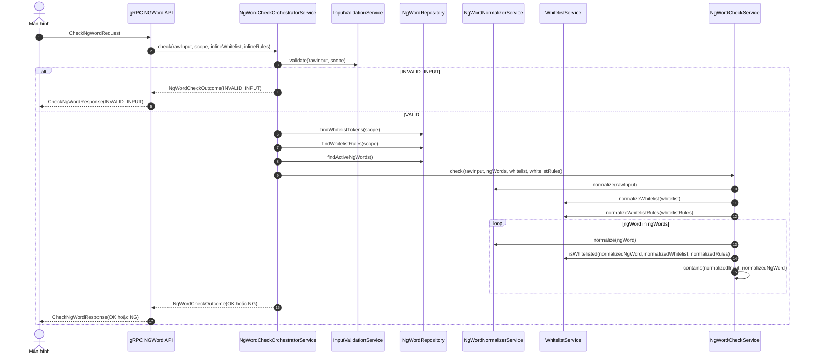

# common-ngword-check

## Tóm tắt
Module common cho nghiệp vụ kiểm tra NG word theo luồng:
`validate (màn hình)` → `gRPC` → `chuẩn hoá/normalize` → `áp whitelist + 表示ゆれ + hira/kana` → `check DB` → `trả kết quả`.

## Thiết kế & naming
- Service contract: `ABCService`
- Service implementation: `ABCServiceImpl` (đặt trong `service/impl`)
- Provider contract: `ABCProvider`
- Provider implementation: `ABCProviderImpl` (đặt trong `service/impl`)

Lưu ý: module này không phụ thuộc Spring. `impl` ở đây chỉ là package phân tách implementation, không phải `@Service`.

## Scope hiện có
- Scope mặc định (đang dùng nếu request không truyền/blank): `default` (`NgWordScopes.DEFAULT`)

Ví dụ scope theo màn hình/nghiệp vụ (placeholder để minh hoạ, cần confirm spec/khách trước khi “chốt”):
- `member_register` (`NgWordScopes.MEMBER_REGISTER`): màn hình đăng ký hội viên
- `member_profile_update` (`NgWordScopes.MEMBER_PROFILE_UPDATE`): màn hình cập nhật hồ sơ
- `inquiry_free_text` (`NgWordScopes.INQUIRY_FREE_TEXT`): ô nhập free text (inquiry/notes)
- `admin_bulk_import` (`NgWordScopes.ADMIN_BULK_IMPORT`): luồng import/batch admin

## Tong so function public
- Tong cong: 29 function public (bao gom constructor public)

## Phân tích ngược từ yêu cầu → cần function nào
Từ nội dung trao đổi (legacy SQL `FUNC_CNV_CHKWORD`, flow gRPC, whitelist, 表示ゆれ, hira/kana), module cần tối thiểu các
contract API sau để đáp ứng đầy đủ:

### Contract API (interface) và mục đích sử dụng

#### gRPC entrypoint
- `NgWordGrpcFacade.checkNgWord(CheckNgWordRequest request)`
  - Dùng để: nhận request từ gRPC layer, gọi pipeline nghiệp vụ, trả `OK/NG/INVALID_INPUT`.
  - Input ví dụ:
    - `request.input = "abc@1"`
    - `request.scope = "default"`
    - `request.inlineWhitelist = {"ABC"}`
    - `request.inlineWhitelistRules = {}`
  - Output ví dụ (OK):
    - `response.status = OK`
    - `response.ng = false`
    - `response.normalizedInput = "ＡＢＣ１"`
    - `response.matchedRawNgWord = null`
    - `response.matchedNormalizedNgWord = null`
    - `response.validationIssues = []`
  - Output ví dụ (NG):
    - `response.status = NG`
    - `response.ng = true`
    - `response.normalizedInput = "ＡＢＣ１"`
    - `response.matchedRawNgWord = "ABC"`
    - `response.matchedNormalizedNgWord = "ＡＢＣ"`
    - `response.validationIssues = []`

#### Orchestrator (pipeline)
- `NgWordCheckOrchestratorService.check(String rawInput, String scope, Set<String> inlineWhitelist, Set<WhitelistRule> inlineRules)`
  - Dùng để: điều phối đầy đủ `validate -> merge whitelist -> check DB`.
  - Input ví dụ:
    - `rawInput = "abc@1"`
    - `scope = "default"`
    - `inlineWhitelist = {}`
    - `inlineRules = {}`
  - Output ví dụ:
    - `outcome.status = OK` hoặc `NG` hoặc `INVALID_INPUT`
    - `outcome.validation.valid = true/false`
    - `outcome.checkResult.normalizedInput = "..."` (chuỗi sau normalize)

#### Validate input (trước khi check NG)
- `InputValidationService.validate(String rawInput, String scope)`
  - Dùng để: kiểm tra input có hợp lệ theo rule của từng màn hình/nghiệp vụ hay không.
  - Input ví dụ (invalid):
    - `rawInput = ""`
    - `scope = "default"`
  - Output ví dụ:
    - `valid = false`
    - `issues = [{code="REQUIRED", message="Input is required", rejectedValue=""}]`

- `PatternRuleProvider.getRules(String scope)`
  - Dùng để: trả danh sách `PatternRule` theo scope (mỗi scope có thể có bộ rule khác nhau).
  - Input ví dụ: `scope = "default"`
  - Output ví dụ:
    - `rules = [PatternRule(...), PatternRule(...), ...]`

#### Normalize (chuẩn hoá theo legacy SQL + mở rộng)
- `NgWordNormalizerService.normalize(String text)`
  - Dùng để: chuẩn hoá chuỗi phục vụ so khớp (áp dụng chung cho input user, NG token trong DB, whitelist token).
  - Rule yêu cầu tối thiểu:
    1) lower → upper
    2) half-width → full-width
    3) remove ASCII symbols (sau khi đã full-width hoá)
  - Mở rộng theo yêu cầu:
    - hira → kata (khi bật)
    - 表示ゆれ mapping (khi cấu hình)
  - Input/Output ví dụ:
    - Input: `text = "abc@1"`
    - Output: `"ＡＢＣ１"`
  - Diễn giải bước (để đối soát với legacy SQL):
    1) Upper: `"ABC@1"`
    2) Half-width -> Full-width: `"ＡＢＣ＠１"`
    3) Remove ASCII symbols: `"ＡＢＣ１"`

- `NormalizationProfileProvider.getProfile(String domainOrScreen)`
  - Dùng để: bật/tắt các bước normalize theo scope (upper, hira→kata, half→full, remove symbols, mapping).
  - Input ví dụ: `domainOrScreen = "default"`
  - Output ví dụ:
    - `NormalizationProfile(uppercase=true, hiraganaToKatakana=true, halfwidthToFullwidth=true, removeAsciiSymbols=true, ...)`

- `NormalizationProfileProvider.getNotationVariantMap(String domainOrScreen)`
  - Dùng để: cung cấp mapping 表示ゆれ theo scope.
  - Input ví dụ: `domainOrScreen = "default"`
  - Output ví dụ: `{ "髙":"高", "ヵ":"カ" }`

#### Whitelist (token + rule)
- `WhitelistService.normalizeWhitelist(Set<String> rawWhitelist)`
  - Dùng để: chuẩn hoá whitelist token về cùng chuẩn với normalize.
  - Input/Output ví dụ:
    - Input: `rawWhitelist = {"abc", "a@1"}`
    - Output: `{"ＡＢＣ", "Ａ１"}` (giả sử `@` bị loại bỏ theo rule)

- `WhitelistService.normalizeWhitelistRules(Collection<WhitelistRule> rules)`
  - Dùng để: chuẩn hoá whitelist rule, đặc biệt `EXACT` token phải normalize trước khi match.
  - Input/Output ví dụ:
    - Input: `{(EXACT,"abc"), (REGEX,"^ＴＥＳＴ.*$")}`
    - Output: `{(EXACT,"ＡＢＣ"), (REGEX,"^ＴＥＳＴ.*$")}`

- `WhitelistService.isWhitelisted(String normalizedNgWord, Set<String> normalizedWhitelist, Set<WhitelistRule> normalizedRules)`
  - Dùng để: quyết định token NG đã normalize có được bỏ qua hay không.
  - Input/Output ví dụ:
    - Input: `normalizedNgWord = "ＡＢＣ"`, `normalizedWhitelist = {"ＡＢＣ"}`, `normalizedRules = {}`
    - Output: `true`

#### Check NG word (matching)
- `NgWordCheckService.check(String rawInput, Collection<String> ngWords, Set<String> whitelist, Set<WhitelistRule> whitelistRules)`
  - Dùng để: normalize input + normalize từng NG token + áp whitelist + `contains` để phát hiện NG.
  - Input ví dụ:
    - `rawInput = "abc@1"`
    - `ngWords = ["ABC"]`
    - `whitelist = {}`
    - `whitelistRules = {}`
  - Output ví dụ:
    - `NgWordCheckResult(ng=true, normalizedInput="ＡＢＣ１", matchedRawNgWord="ABC", matchedNormalizedNgWord="ＡＢＣ")`

#### DB boundary (lấy NG/whitelist từ table)
- `NgWordRepository.findActiveNgWords()`
  - Dùng để: lấy danh sách NG word active từ DB.

- `NgWordRepository.findWhitelistTokens(String scope)`
  - Dùng để: lấy whitelist token theo scope từ DB (nếu có).

- `NgWordRepository.findWhitelistRules(String scope)`
  - Dùng để: lấy whitelist rule (EXACT/REGEX) theo scope từ DB (nếu có).

- `NgWordDbCheckService.checkAgainstDbByScope(String rawInput, String scope)`
  - Dùng để: wrapper tiện dụng để check NG theo scope bằng data từ repository.
  - Input/Output ví dụ:
    - Input: `rawInput = "abc@1"`, `scope = "default"`
    - Output: `NgWordCheckResult(...)` (tương tự `NgWordCheckService.check`)

## Mapping yêu cầu nghiệp vụ → function liên quan (tóm tắt)

### 1) Validate input có hợp lệ không (theo pattern/scope)
- `InputValidationService.validate(String rawInput, String scope)`
- `PatternRuleProvider.getRules(String scope)`
- Model liên quan: `PatternRule`, `InputValidationResult`, `InputValidationIssue`

Giải thích về `scope`:
- `scope` là key để chọn “bộ rule validate/normalize/whitelist” theo màn hình hoặc nghiệp vụ, không phải cơ chế phân quyền.
- `scope = "default"` dùng khi không có yêu cầu phân tách rule theo màn hình/nghiệp vụ.
- Nếu `scope` null/blank, implementation nên fallback về `"default"` để tránh NPE và đảm bảo hành vi nhất quán.

Ví dụ input:
- `rawInput = "abc@1"`, `scope = "default"`
- Nếu rule yêu cầu tối thiểu 1 ký tự: `rawInput = ""` → `InputValidationResult.valid=false`

### 2) Chuẩn hoá input theo rule legacy SQL (FUNC_CNV_CHKWORD)
Rule đã confirm:
1. Chuyển chữ thường → chữ hoa (abc → ABC)
2. Chuyển ký tự half-width → full-width (A → Ａ, 1 → １)
3. Loại bỏ các ký hiệu ASCII (ví dụ @ # $ % ! sau khi đã full-width hoá)

Function liên quan:
- `NgWordNormalizerService.normalize(String text)` (dùng chung cho input user, NG token và whitelist)

Ví dụ:
- Input: `"abc@1"` → Upper: `"ABC@1"` → Full-width: `"ＡＢＣ＠１"` → Remove symbols: `"ＡＢＣ１"`
- Input: `"A-1"` → Full-width: `"Ａ－１"` → Remove symbols (nếu `－` nằm trong set loại bỏ) → `"Ａ１"`

### 3) 表示ゆれ (các cách viết có cùng nghĩa) và chuyển đổi hira/kana
- `NormalizationProfileProvider.getProfile(String domainOrScreen)` (bật/tắt các bước: upper, hira→kata, half→full, remove symbols, mapping)
- `NormalizationProfileProvider.getNotationVariantMap(String domainOrScreen)` (mapping 表示ゆれ)
- Model liên quan: `NormalizationProfile`

Ghi chú: phần “ký tự/biến thể theo Shift_JIS” hiện đang được xử lý ở mức compatibility normalize (NFKC) + mapping 表示ゆれ
trong implementation của `NgWordNormalizerService` theo profile. Nếu cần map chi tiết hơn dựa trên `Shift_JIS 文字コード表.html`
thì sẽ mở rộng implementation của `NormalizationProfileProvider` (mapping + removable symbols) hoặc bổ sung bước normalize riêng.

Ví dụ:
- `"ゔぁ"` (hiragana) → `"ヴァ"` (katakana) nếu bật `hiraganaToKatakana`
- `"髙"` → `"高"` nếu mapping 表示ゆれ có cấu hình

### 4) Whitelist (token) + rule whitelist (EXACT/REGEX)
- `WhitelistService.normalizeWhitelist(Set<String> rawWhitelist)`
- `WhitelistService.normalizeWhitelistRules(Collection<WhitelistRule> rules)`
- `WhitelistService.isWhitelisted(String normalizedNgWord, Set<String> normalizedWhitelist, Set<WhitelistRule> normalizedRules)`
- Model liên quan: `WhitelistRule`, `WhitelistMatchMode`

Ví dụ:
- `inlineWhitelist = {"abc"}` → normalize token → `{"ＡＢＣ"}`
- `inlineWhitelistRules = { (mode=REGEX, value=\"^ＴＥＳＴ.*$\") }`

### 5) Check NG word trong DB (sau normalize)
- `NgWordRepository.findActiveNgWords()` (caller sẽ implement lấy từ table NG word)
- `NgWordCheckService.check(String rawInput, Collection<String> ngWords, Set<String> whitelist, Set<WhitelistRule> whitelistRules)`
- `NgWordDbCheckService.checkAgainstDbByScope(String rawInput, String scope)` (load whitelist theo scope từ repository)
- Model liên quan: `NgWordCheckResult`

Ví dụ:
- `ngWords = ["ABC"]`, input `"abc@1"` → normalized input `"ＡＢＣ１"` → match `"ＡＢＣ"` → `NgWordCheckResult.ng=true`

### 6) Luồng tổng quát gRPC: convert → check DB → trả OK/NG/INVALID_INPUT
- `NgWordGrpcFacade.checkNgWord(CheckNgWordRequest request)`
- `NgWordCheckOrchestratorService.check(String rawInput, String scope, Set<String> inlineWhitelist, Set<WhitelistRule> inlineRules)`
- Model liên quan: `CheckNgWordRequest`, `CheckNgWordResponse`, `NgWordCheckOutcome`, `CheckStatus`

## Flow / sequence diagram

### Sequence diagram (gợi ý triển khai)


## SQL Injection có cần xử lý trong hàm normalize không?
Không.
- Normalize chỉ phục vụ so khớp nghiệp vụ NG word (tương đương FUNC_CNV_CHKWORD).
- Chống SQL injection phải xử lý ở tầng truy vấn bằng prepared statement/bind parameter (không concat SQL từ input user).

## Public symbols (kỹ thuật, bao gồm cả implementation)
```text
common-ngword-check/src/main/java/com/yourdomain/common/ngword/grpc/CheckNgWordRequest.java:14:public record CheckNgWordRequest(
common-ngword-check/src/main/java/com/yourdomain/common/ngword/grpc/CheckNgWordResponse.java:17:public record CheckNgWordResponse(
common-ngword-check/src/main/java/com/yourdomain/common/ngword/grpc/NgWordGrpcFacadeImpl.java:19:    public NgWordGrpcFacadeImpl(NgWordCheckOrchestratorService orchestrator) {
common-ngword-check/src/main/java/com/yourdomain/common/ngword/grpc/NgWordGrpcFacadeImpl.java:30:    public CheckNgWordResponse checkNgWord(CheckNgWordRequest request) {
common-ngword-check/src/main/java/com/yourdomain/common/ngword/model/InputValidationIssue.java:10:public record InputValidationIssue(
common-ngword-check/src/main/java/com/yourdomain/common/ngword/model/InputValidationResult.java:11:public record InputValidationResult(
common-ngword-check/src/main/java/com/yourdomain/common/ngword/model/NgWordCheckOutcome.java:10:public record NgWordCheckOutcome(
common-ngword-check/src/main/java/com/yourdomain/common/ngword/model/NgWordCheckResult.java:11:public record NgWordCheckResult(
common-ngword-check/src/main/java/com/yourdomain/common/ngword/model/NormalizationProfile.java:16:public record NormalizationProfile(
common-ngword-check/src/main/java/com/yourdomain/common/ngword/model/PatternRule.java:12:public record PatternRule(
common-ngword-check/src/main/java/com/yourdomain/common/ngword/model/WhitelistRule.java:9:public record WhitelistRule(
common-ngword-check/src/main/java/com/yourdomain/common/ngword/service/impl/InputValidationServiceImpl.java:22:    public InputValidationServiceImpl(PatternRuleProvider patternRuleProvider) {
common-ngword-check/src/main/java/com/yourdomain/common/ngword/service/impl/InputValidationServiceImpl.java:39:    public InputValidationResult validate(String rawInput, String scope) {
common-ngword-check/src/main/java/com/yourdomain/common/ngword/service/impl/NgWordCheckOrchestratorServiceImpl.java:28:    public NgWordCheckOrchestratorServiceImpl(
common-ngword-check/src/main/java/com/yourdomain/common/ngword/service/impl/NgWordCheckOrchestratorServiceImpl.java:52:    public NgWordCheckOutcome check(String rawInput, String scope, Set<String> inlineWhitelist, Set<WhitelistRule> inlineRules) {
common-ngword-check/src/main/java/com/yourdomain/common/ngword/service/impl/NgWordCheckServiceImpl.java:22:    public NgWordCheckServiceImpl(NgWordNormalizerService normalizer, WhitelistService whitelistService) {
common-ngword-check/src/main/java/com/yourdomain/common/ngword/service/impl/NgWordCheckServiceImpl.java:41:    public NgWordCheckResult check(
common-ngword-check/src/main/java/com/yourdomain/common/ngword/service/impl/NgWordDbCheckServiceImpl.java:21:    public NgWordDbCheckServiceImpl(NgWordRepository repository, NgWordCheckService checkService) {
common-ngword-check/src/main/java/com/yourdomain/common/ngword/service/impl/NgWordDbCheckServiceImpl.java:35:    public NgWordCheckResult checkAgainstDb(String rawInput, Set<String> whitelist, Set<WhitelistRule> whitelistRules) {
common-ngword-check/src/main/java/com/yourdomain/common/ngword/service/impl/NgWordDbCheckServiceImpl.java:47:    public NgWordCheckResult checkAgainstDbByScope(String rawInput, String scope) {
common-ngword-check/src/main/java/com/yourdomain/common/ngword/service/impl/NgWordNormalizerServiceImpl.java:23:    public NgWordNormalizerServiceImpl(NormalizationProfileProvider profileProvider, String domainOrScreen) {
common-ngword-check/src/main/java/com/yourdomain/common/ngword/service/impl/NgWordNormalizerServiceImpl.java:35:    public String normalize(String text) {
common-ngword-check/src/main/java/com/yourdomain/common/ngword/service/impl/NormalizationProfileProviderImpl.java:21:    public NormalizationProfile getProfile(String domainOrScreen) {
common-ngword-check/src/main/java/com/yourdomain/common/ngword/service/impl/NormalizationProfileProviderImpl.java:38:    public Map<String, String> getNotationVariantMap(String domainOrScreen) {
common-ngword-check/src/main/java/com/yourdomain/common/ngword/service/impl/PatternRuleProviderImpl.java:20:    public List<PatternRule> getRules(String scope) {
common-ngword-check/src/main/java/com/yourdomain/common/ngword/service/impl/WhitelistServiceImpl.java:23:    public WhitelistServiceImpl(NgWordNormalizerService normalizer) {
common-ngword-check/src/main/java/com/yourdomain/common/ngword/service/impl/WhitelistServiceImpl.java:33:    public Set<String> normalizeWhitelist(Set<String> rawWhitelist) {
common-ngword-check/src/main/java/com/yourdomain/common/ngword/service/impl/WhitelistServiceImpl.java:55:    public Set<WhitelistRule> normalizeWhitelistRules(Collection<WhitelistRule> rules) {
common-ngword-check/src/main/java/com/yourdomain/common/ngword/service/impl/WhitelistServiceImpl.java:81:    public boolean isWhitelisted(String normalizedNgWord, Set<String> normalizedWhitelist, Set<WhitelistRule> normalizedRules) {
```
